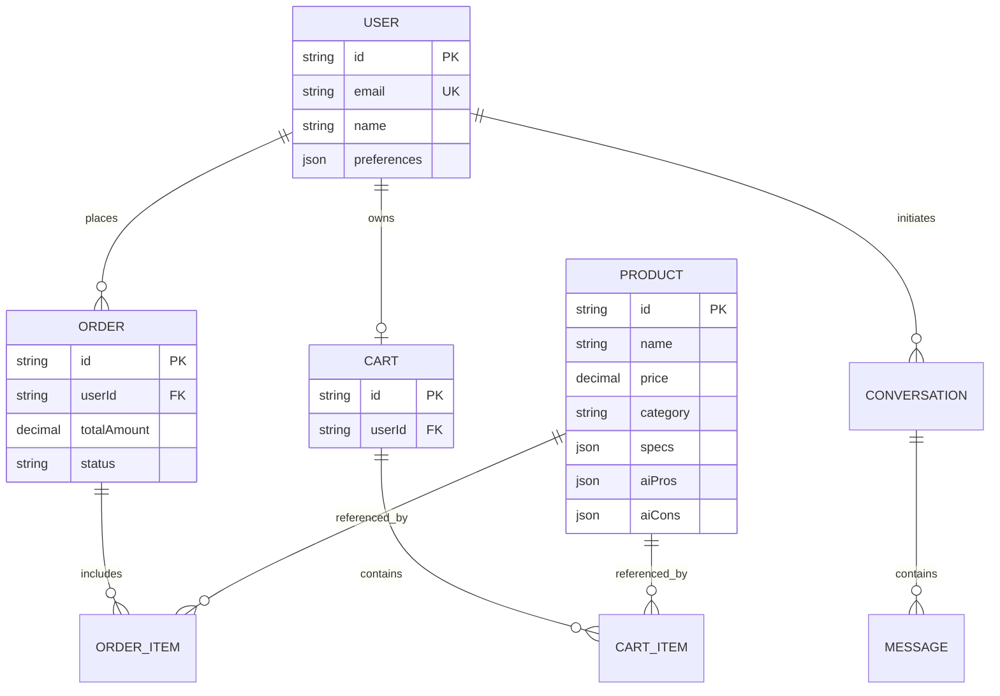

# SmartShop AI - Database Design

## Relational Entity Diagram

```mermaid
erDiagram
    USER ||--o{ ORDER : places
    USER ||--o| CART : owns
    USER ||--o{ CONVERSATION : initiates
    CART ||--o{ CART_ITEM : contains
    ORDER ||--o{ ORDER_ITEM : includes
    PRODUCT ||--o{ CART_ITEM : referenced_by
    PRODUCT ||--o{ ORDER_ITEM : referenced_by
    CONVERSATION ||--o{ MESSAGE : contains

    USER {
        string id PK
        string email UK
        string name
        json preferences
    }

    PRODUCT {
        string id PK
        string name
        decimal price
        string category
        json specs
        json aiPros
        json aiCons
    }

    CART {
        string id PK
        string userId FK
    }

    ORDER {
        string id PK
        string userId FK
        decimal totalAmount
        string status
    }
```
